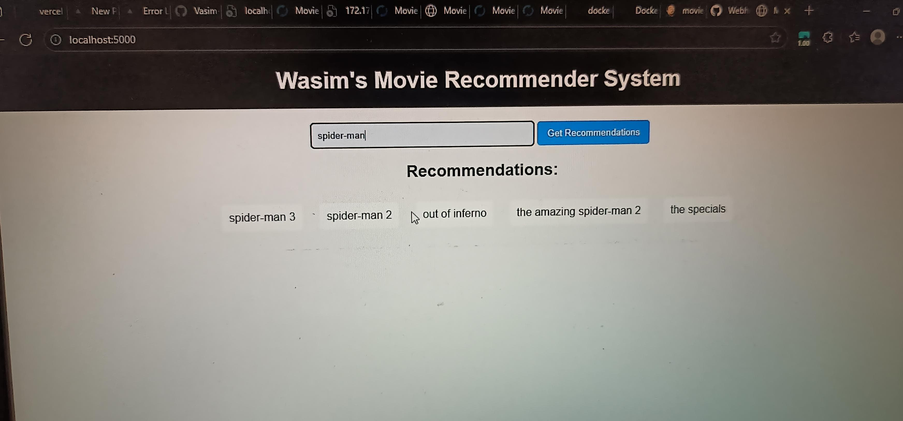
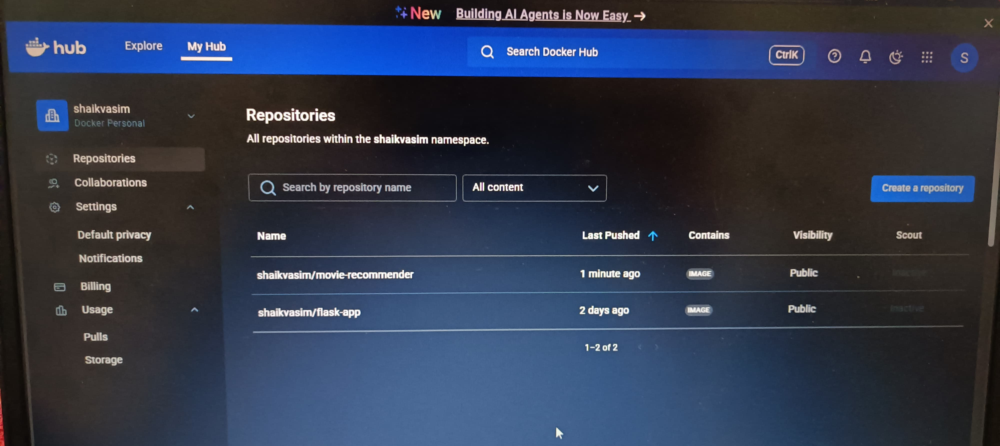
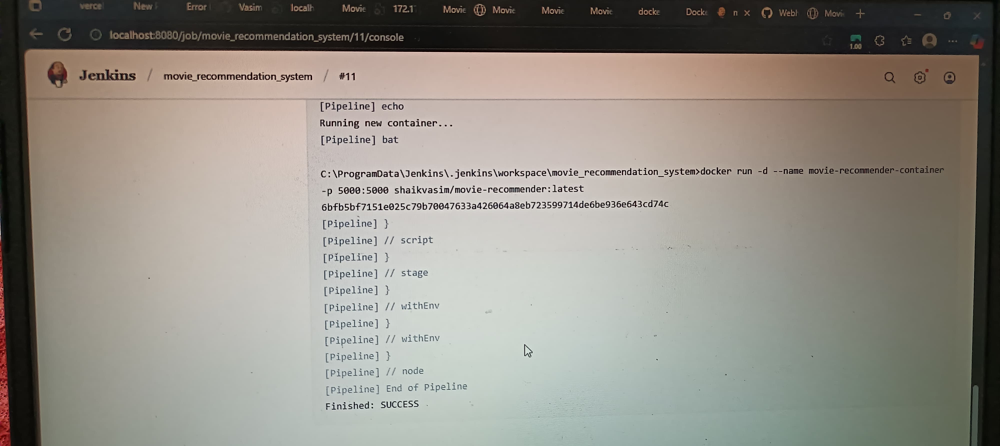
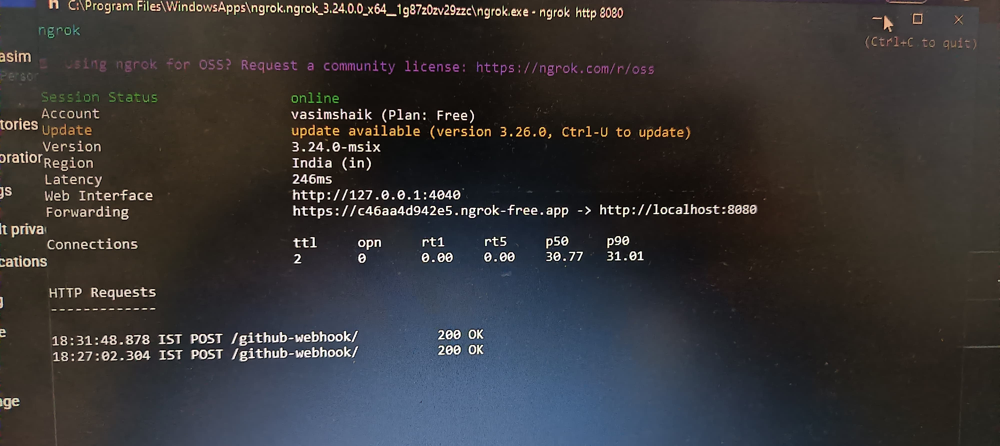
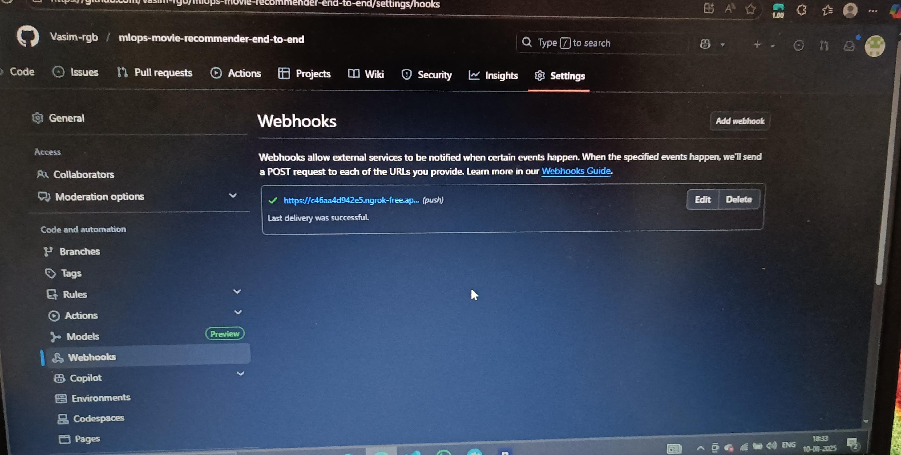

# Movie Recommender MLOps Project
**<h3><b><u>This project is an end-to-end MLOps pipeline for a movie recommender system using Flask, Docker, Jenkins, and GitHub webhooks,Vercel_deployment.</u></b></h3>**
> **Note:** Vercel serverless functions have a hard limit of 250MB for deployment size. This project may exceed that limit due to model and data artifacts, so direct deployment to Vercel serverless may not be possible without optimizing or reducing the size of dependencies and artifacts.
## Demo Screenshots
### Movie Recommendation Demo


### Docker Container Status


### Jenkins Dashboard


### Ngrok Tunnel for Webhook


### GitHub Webhook Configuration


---

This project is an end-to-end MLOps pipeline for a movie recommender system using Flask, Docker, Jenkins, and GitHub webhooks.

## Features
- Movie recommendation web app built with Flask
- Model training and prediction pipeline
- Containerized with Docker
- Automated CI/CD with Jenkins
- GitHub webhook integration for automated builds

## Project Structure
- `app.py`: Flask web application
- `src/`: Source code for data pipelines and model
- `artifacts/`: Model and data artifacts
- `Dockerfile`: Container build instructions
- `Jenkinsfile`: Jenkins pipeline configuration
- `images/`: Screenshots and visual documentation

## Workflow Overview
1. **Build Docker Image**: The Flask app and model are containerized using Docker.
2. **Push to Docker Hub**: The image is pushed to Docker Hub for deployment.
3. **Jenkins Pipeline**: Jenkins pulls the latest image and runs the container.
4. **GitHub Webhook**: Any push to the repository triggers Jenkins to redeploy the app.

## How to Run

1. **Build and Run Locally**
   ```bash
   docker build -t movie-recommender .
   docker run -p 5000:5000 movie-recommender
   ```
   Access the app at [http://localhost:5000](http://localhost:5000)

2. **Push to Docker Hub**
   ```bash
   docker tag movie-recommender shaikvasim/movie-recommender:latest
   docker login
   docker push shaikvasim/movie-recommender:latest
   ```

3. **Jenkins Setup**
   - Run Jenkins in Docker:
     ```bash
     docker run -d -p 8081:8080 -p 50000:50000 -v jenkins_home:/var/jenkins_home jenkins/jenkins:lts
     ```
   - Configure Jenkins pipeline using `Jenkinsfile`.
   - Set up credentials for Docker Hub.

4. **GitHub Webhook**
   - Configure your repository webhook to point to your Jenkins/ngrok endpoint.

## License
MIT
